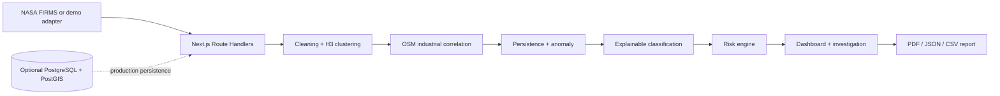

# Thermal Sentinel

**SIH26162 — AI-Based Detection and Classification of Industrial Fires and Persistent Thermal Sources Using NASA FIRMS, OSM & Satellite Data**

Thermal Sentinel is a single, Next.js geospatial intelligence application. It cleans and clusters thermal observations, adds industrial and historical context, measures persistence and anomaly, applies an AI-assisted explainable classification baseline, prioritizes events with transparent risk scoring, and generates investigation reports.

> Demo mode uses **SYNTHETIC DEMONSTRATION DATA**. It never claims real FIRMS observations, satellite imagery, trained-model accuracy, or confirmed fires.

## Architecture



There is no FastAPI server, Python runtime, Docker sidecar, or second deployment. Secrets remain inside server-side Route Handlers.

## Features preserved and improved

- Professional dark command center, event queue, filters, analytical charts and map legend
- Leaflet and React Leaflet with real OpenStreetMap tiles, marker clustering, event popups, risk halos, industrial overlays, zoom/pan controls, and automatic event bounds
- Deterministic 32-event demo with persistent industrial source, industrial fire, wildfire, agricultural burning, and unknown scenarios
- Judge funnel: **127 observations → 32 clustered events → 11 significant → 5 high priority → 2 critical**
- H3 clustering, coordinate validation, persistence, anomaly, six-class explainable classification and configurable risk weights
- Investigation timeline, persistence evidence, risk breakdown, industrial context, satellite status, recommended action and disclaimer
- Vercel-compatible in-memory PDF, JSON and CSV exports with no filesystem writes
- Demo/live switch; live FIRMS and OSM failures return clear status and safely fall back
- Optional PostGIS schema retained at `lib/db/schema.sql`

## Intelligence methodology

The pipeline remains `SCOUT → DETECT → CORRELATE → CLASSIFY → PRIORITIZE → REPORT`.

Persistence uses observation count, active days, recurrence and temporal span. A single observation is always `TRANSIENT`. Anomaly scoring combines brightness deviation, local density, temporal behavior and spatial isolation. Classification uses thermal, temporal, industrial and land-use evidence and is explicitly labeled an **AI-assisted explainable baseline**, not a trained model.

Risk weights are configurable in `lib/risk-engine.ts`:

| Factor | Weight |
|---|---:|
| Thermal intensity | 20% |
| Detection confidence | 15% |
| Persistence | 20% |
| Industrial context | 20% |
| Event size | 10% |
| Recurrence | 10% |
| Anomaly | 5% |

Risk bands are Low 0–25, Medium 26–50, High 51–75 and Critical 76–100. Every result includes a factor breakdown and explanation.

## Local setup

Requires Node.js 20 or newer.

```bash
git clone https://github.com/Mohit16S/thermal-sentinel.git
cd thermal-sentinel
cp .env.example .env.local
npm install
npm run dev
```

Open [http://localhost:3000](http://localhost:3000). Demo mode works without environment variables.

Verification commands:

```bash
npm test
npm run lint
npm run build
npm start
```

## Environment variables

```dotenv
NASA_FIRMS_API_KEY=
DATABASE_URL=
```

- `NASA_FIRMS_API_KEY`: optional server-only key used by `/api/firms` and live pipeline mode. Never prefix it with `NEXT_PUBLIC_`.
- `DATABASE_URL`: optional PostgreSQL/PostGIS connection for a future persistent data adapter. The current serverless demo does not require or write to a database.

The map requires no API token. It uses the standard OpenStreetMap tile endpoint with visible OpenStreetMap attribution.

## Route Handlers

- `GET /api/health`
- `GET /api/dashboard/stats?mode=demo|live`
- `GET|POST /api/events`
- `GET /api/events/high-risk`
- `GET /api/events/[id]`
- `GET /api/events/[id]/history`
- `GET /api/events/[id]/context`
- `GET /api/events/[id]/satellite`
- `GET /api/events/[id]/analysis`
- `POST /api/analysis`
- `GET /api/firms?mode=live`
- `GET /api/osm?lat=...&lon=...`
- `GET /api/reports/[id]`
- `GET|POST /api/reports/[id]/generate?format=pdf|json|csv`

External fetches use Next.js revalidation caching. FIRMS is cached for 15 minutes and Overpass context for 24 hours.

## GitHub push

The repository already has `origin` configured. Review before publishing:

```bash
git status
git diff --stat
git add -A
git commit -m "Migrate Thermal Sentinel to a single Vercel-ready Next.js app"
git push origin main
```

If starting from a repository without a remote:

```bash
git init
git branch -M main
git remote add origin https://github.com/YOUR_USERNAME/thermal-sentinel.git
git add -A
git commit -m "Initial Vercel-ready Thermal Sentinel"
git push -u origin main
```

## Vercel deployment

1. Push the repository to GitHub.
2. In Vercel, choose **Add New → Project** and import the repository.
3. Keep Framework Preset as **Next.js** and Root Directory as `./`.
4. Add `NASA_FIRMS_API_KEY` and `DATABASE_URL` only when available. Neither is required for demo mode, and the map needs no environment variable.
5. Select **Deploy**. No backend project, server command, persistent disk, or Docker service is required.
6. After deployment, verify `/`, `/investigation/TS-2026-0001`, `/api/health`, and report downloads.

## Demo walkthrough

1. Start on the command center and identify the `SYNTHETIC DEMONSTRATION DATA` badge.
2. Explain the 127→32→11→5→2 prioritization funnel.
3. Filter to Critical and select `TS-2026-0001`.
4. Inspect thermal history, persistence, risk factors, OSM-like industrial context and explainable evidence.
5. Note that satellite imagery is explicitly unavailable and no fire is confirmed.
6. Export PDF, JSON or CSV.
7. Show Live Mode; without a FIRMS key it displays the failure reason and returns safely to demo data.

## Limitations and roadmap

- The included OSM facilities are synthetic demo context; live event-specific Overpass enrichment is available through the API but can be rate-limited.
- The standard OpenStreetMap tile service is appropriate for this prototype and must be used in accordance with its tile usage policy. A high-traffic production deployment should use a suitable hosted or self-hosted tile service without removing OpenStreetMap attribution.
- Live FIRMS mode depends on NASA availability, credentials and network access. Cache duration is designed for serverless execution.
- Satellite services expose honest verification status; imagery retrieval and computer-vision analysis are future work.
- `DATABASE_URL` is reserved for an optional managed PostGIS adapter; Vercel instances must not rely on local files or in-memory persistence.
- Production work should add authentication, rate limiting, analyst-reviewed labels, calibrated XGBoost/Random Forest inference, managed PostGIS storage and field-verification feedback.

This assessment is decision-support information and does not independently confirm a fire.
