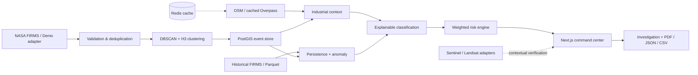

# Thermal Sentinel

**SIH26162 — AI-Based Detection and Classification of Industrial Fires and Persistent Thermal Sources Using NASA FIRMS, OSM & Satellite Data**

Thermal Sentinel is a deployable geospatial decision-support prototype that turns thermal observations into clustered events, adds industrial and historical context, measures persistence and anomaly, assigns an explainable classification and risk score, and supports investigation and incident-report export.

> The bundled experience is **SYNTHETIC DEMONSTRATION DATA**. Its classifier is an **explainable rule-based baseline**, not a trained production ML model. It does not confirm fires. Satellite images are never invented.

## Why it matters

A heat-point map creates noise, not operational clarity. Thermal Sentinel implements the full `SCOUT → DETECT → CORRELATE → CLASSIFY → PRIORITIZE → REPORT` workflow and makes every prioritization inspectable.

## Architecture



## Technology

- Next.js, React, TypeScript, Tailwind, Recharts, Mapbox GL JS with a token-free geospatial fallback
- FastAPI, Pydantic, ReportLab
- Python analytics architecture for scikit-learn/XGBoost, DBSCAN, GeoPandas/Shapely, H3 and pyproj
- PostgreSQL 16 + PostGIS geometry columns and GiST indexes; Redis-ready caching
- Docker Compose for frontend, backend, PostGIS and Redis

## Run with Docker

```bash
cd thermal-sentinel
docker compose up --build
```

Open [http://localhost:3000](http://localhost:3000). API docs are at [http://localhost:8000/docs](http://localhost:8000/docs).

## Local development (no Docker)

Backend (Python 3.11+):

```bash
cd thermal-sentinel/backend
python3 -m venv .venv
source .venv/bin/activate
pip install -r requirements.txt
uvicorn app.main:app --reload --port 8000
```

Frontend (Node 20+), in another terminal:

```bash
cd thermal-sentinel/frontend
cp .env.example .env.local
npm install
npm run dev
```

The local demo is intentionally in-memory and requires neither PostgreSQL nor Redis. Production-shaped PostGIS schema initialization is automatic in Docker from `backend/app/db/schema.sql`.

## Environment variables

| Variable | Purpose | Required for demo |
|---|---|---|
| `DATABASE_URL` | PostgreSQL/PostGIS connection | No |
| `REDIS_URL` | shared cache | No |
| `NASA_FIRMS_API_KEY` | future live FIRMS adapter | No |
| `NEXT_PUBLIC_MAPBOX_TOKEN` | Mapbox basemap | No; fallback renders automatically |
| `NEXT_PUBLIC_API_URL` | browser/server API base | Defaults to `http://localhost:8000` |
| `CORS_ORIGINS` | allowed frontend origins | No |

Copy the `.env.example` files in `frontend/` and `backend/`. Never commit credentials.

## API

FastAPI publishes OpenAPI automatically. Key routes include health and source status, dashboard statistics, event list/detail/history/context/satellite/analysis, high-risk events, analysis execution, and PDF/JSON/CSV reports. Use `/docs` for the exact contract.

## Methodology

### Detection and geospatial context

The target live pipeline validates coordinates and timestamps, removes duplicates, groups observations using DBSCAN/H3, and persists event geometries. Industrial correlation uses distance and zone membership; the schema includes the equivalent `ST_DWithin` query and spatial indexes. Proximity is evidence, never confirmation.

### Persistence

The score combines observation count, active days, temporal span and recurrence. A single observation is forcibly labeled `TRANSIENT`, regardless of intensity. Repeated evidence can progress through `RECURRING`, `PERSISTENT`, and `HIGHLY PERSISTENT`.

### Classification

The MVP baseline evaluates intensity, recurrence, persistence, industrial context and land-use context. It returns a class, confidence-like heuristic score, and human-readable evidence. The service boundary is designed so a validated XGBoost or Random Forest artifact can replace this baseline later. No accuracy claim is made.

### Transparent risk scoring

Default weights are intensity 20%, detection confidence 15%, persistence 20%, industrial context 20%, size 10%, recurrence 10%, and anomaly 5%. Thresholds: Low 0–25, Medium 26–50, High 51–75, Critical 76–100. Each event includes its leading drivers.

## Demo walkthrough (3–5 minutes)

1. Open the Command Center and call out the permanent synthetic-data badge.
2. Explain the funnel: **127 observations → 32 clustered events → 11 significant → 5 high priority → 2 critical**.
3. Filter to Critical and select the leading event on the map or priority queue.
4. Open its investigation dossier: intensity, timeline, persistence, anomaly, OSM-like context and evidence.
5. Explain that industrial proximity is corroborating context—not proof—and satellite imagery is explicitly unavailable.
6. Export the incident dossier as PDF, JSON or CSV.

## Tests and build

```bash
cd thermal-sentinel/backend
pytest -q

cd ../frontend
npm run build
```

## Data transparency and limitations

- **Bundless demo:** deterministic synthetic FIRMS-like measurements and synthetic OSM-like context.
- **Real architecture:** PostGIS schema, geospatial calculation boundaries, source adapters and export pipeline.
- **Not implemented as live evidence:** live FIRMS fetch, Overpass lookup and optical/SAR imagery retrieval require credentials/network and operational hardening.
- Cloud cover, sensor revisit time, spatial resolution, false positives and missing historical coverage can all constrain conclusions.
- Classifications and priorities support qualified analysts; they are not incident confirmation or an emergency dispatch instruction.

## Roadmap

1. Validate the explainable baseline with analyst-reviewed labels.
2. Train and calibrate XGBoost/Random Forest with temporal holdouts.
3. Add Sentinel-2/Sentinel-1 contextual models and provenance.
4. Add spatiotemporal forecasting.
5. Add authenticated monitoring, alerting and audit trails.
6. Add field-verification workflow and feedback-driven retraining.

## Screenshots

Capture the Command Center and investigation dossier after starting the app; no static screenshot is presented as real live-source evidence.
# thermal-sentinel
